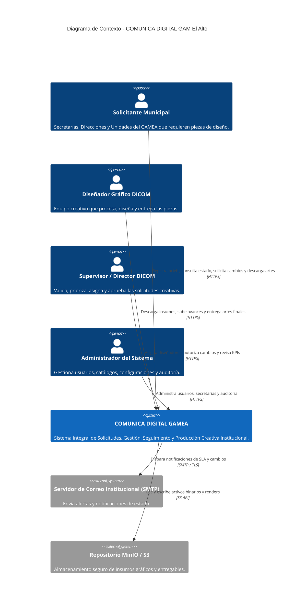
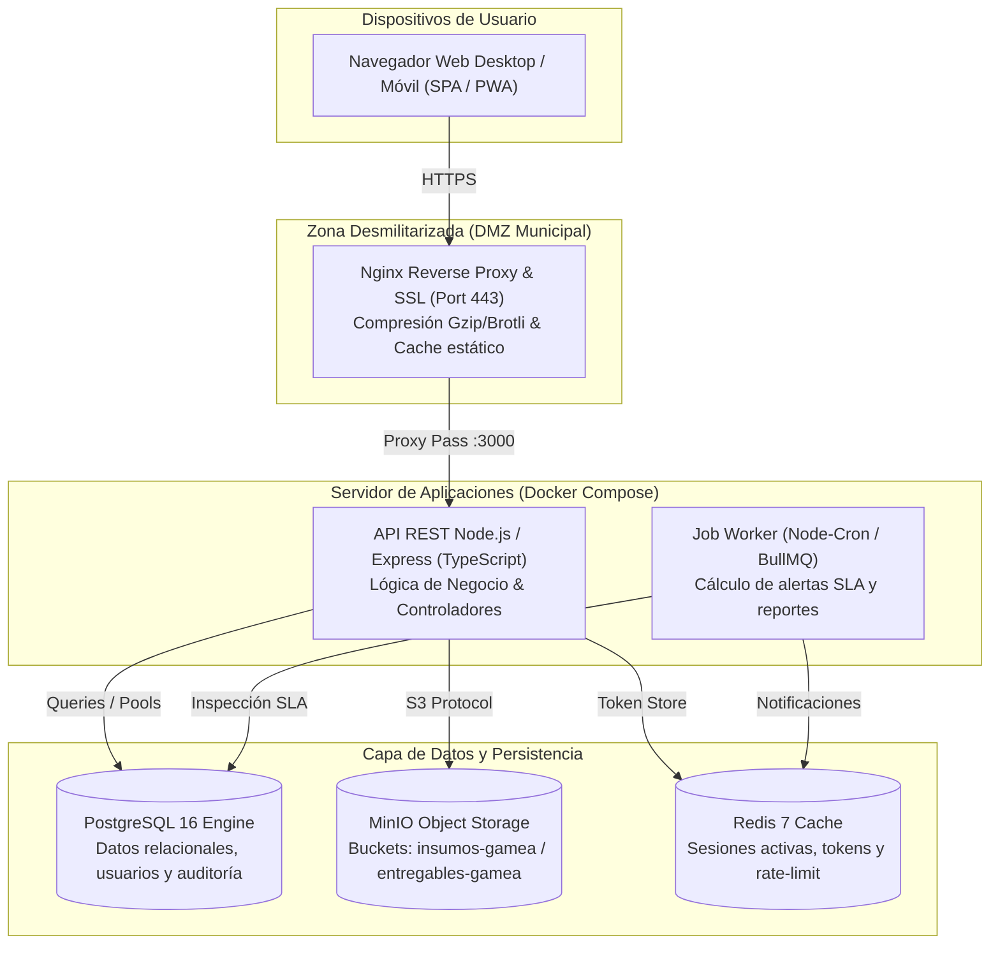
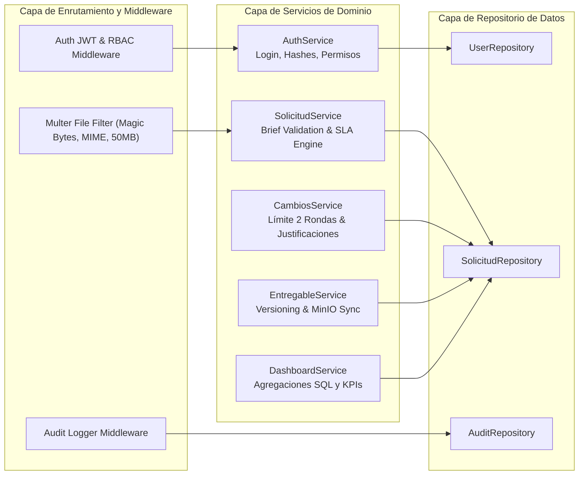
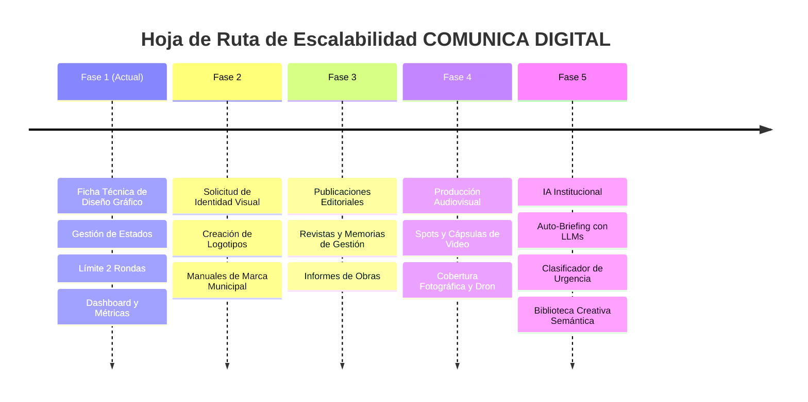

# Arquitectura del Sistema: COMUNICA DIGITAL GAM El Alto
## Plataforma Digital de Gestión Creativa Institucional

**Gobierno Autónomo Municipal de El Alto — Dirección de Comunicación**  
**Nivel de Clasificación:** Documento Técnico de Arquitectura de Software  
**Fecha:** Octubre 2026 | Versión 1.0  

---

## 1. VISIÓN Y PRINCIPIOS ARQUITECTÓNICOS

El sistema está diseñado bajo los siguientes principios rectores de Gobierno Digital:
1. **Soberanía y Autosuficiencia Tecnológica:** Capacidad de operar 100% On-Premise o en centro de datos propio del GAM El Alto, sin dependencias propietarias opacas.
2. **Seguridad Defensiva en Profundidad:** Control de acceso granular RBAC, auditoría de eventos append-only, sanitización estricta de archivos y aislamiento por roles.
3. **Escalabilidad por Fases:** Diseño preparado desde el núcleo para soportar solicitudes de diseño gráfico (Fase 1), logotipos e identidad (Fase 2), revistas y memorias (Fase 3), producción audiovisual y spots (Fase 4) y servicios de Inteligencia Artificial (Fase 5).
4. **Alta Disponibilidad y Rendimiento:** Contenerización con Docker, balanceo de carga mediante Nginx y base de datos relacional PostgreSQL con soporte para réplicas de solo lectura si la carga lo amerita.

---

## 2. MODELO C4 DE ARQUITECTURA

### 2.1 Nivel 1: Diagrama de Contexto del Sistema

### 2.2 Nivel 2: Diagrama de Contenedores

### 2.3 Nivel 3: Diagrama de Componentes del Backend

---

## 3. MOTOR DE TIEMPOS Y REGLAS DE NEGOCIO (SLA)

### 3.1 Algoritmo de Cálculo de Fecha Límite (7 Días Hábiles)
El sistema implementa una función canónica que calcula la fecha límite de entrega según la siguiente fórmula:

$$\text{Fecha Límite} = \text{Fecha Recepción} + 7 \text{ días hábiles}$$

Consideraciones obligatorias:
1. **Días no laborables regulares:** Se excluyen sábados y domingos.
2. **Feriados Nacionales (Bolivia):** 1 de enero, Carnaval (lunes y martes), Viernes Santo, 1 de mayo, Corpus Christi, 21 de junio (Año Nuevo Andino Amazónico), 6 de agosto (Día de la Independencia), 2 de noviembre (Todos Santos), 25 de diciembre.
3. **Feriado Municipal Cívico:** **6 de Marzo** (Aniversario de la Creación de la Ciudad de El Alto).
4. **Corte Horario de Recepción:** Solicitudes enviadas después de las **16:00** se consideran recibidas a las 08:00 del día hábil siguiente.

### 3.2 Máquina de Estados de la Solicitud

| Estado | Código Visual | Descripción | Transición Siguiente |
|---|---|---|---|
| `PENDIENTE` | 🟡 `#EAB308` | Solicitud recibida, a la espera de validación de brief por DICOM. | `EN_REVISION` o Rechazada |
| `EN_REVISION` | 🔵 `#3B82F6` | Supervisor valida insumos y asigna diseñador oficial. | `DISENO_PROCESO` |
| `DISENO_PROCESO`| 🟣 `#8B5CF6` | Diseñador asignado se encuentra elaborando la pieza o boceto. | `AJUSTES` o `APROBADO` |
| `AJUSTES` | 🟠 `#F97316` | Solicitante emitió observaciones (Ronda 1 o Ronda 2). | `DISENO_PROCESO` |
| `APROBADO` | 🟢 `#10B981` | Solicitante y Supervisor dieron conformidad formal a la pieza. | `FINALIZADO` |
| `FINALIZADO` | ⚫ `#475569` | Archivos de alta resolución descargados y archivados en memoria institucional. | Archivo Histórico |

---

## 4. ARQUITECTURA DE SEGURIDAD Y PRIVACIDAD

1. **Autenticación:** JSON Web Tokens (JWT) firmados con algoritmo asimétrico RS256 o HS512, con expiración corta (30 minutos para el access token) y rotación de Refresh Tokens almacenados en cookies HttpOnly y Secure.
2. **Control de Acceso Basado en Roles (RBAC):**
   - `ADMIN`: Control total de catálogos, usuarios, auditoría y parametrizaciones.
   - `SUPERVISOR`: Asignación de solicitudes, priorización, aprobación técnica y estadísticas.
   - `DISENADOR`: Acceso a solicitudes asignadas, subida de borradores y artes finales.
   - `SOLICITANTE`: Registro de solicitudes de su dependencia, aprobación o solicitud de cambios.
3. **Validación de Archivos:**
   - Inspección de cabeceras mágicas (*Magic Bytes*) para impedir camuflaje de ejecutables en extensiones de imagen.
   - Almacenamiento con UUIDs anonimizados en MinIO; el nombre original se almacena solo en metadatos de la base de datos.
4. **Auditoría Transaccional:** Cada inserción, actualización de estado o descarga genera un registro inmutable en `auditoria_eventos` con marca temporal UTC, IP origen, user-agent y payload diferencial.

---

## 5. MAPA DE RUTA Y EXTENSIBILIDAD PARA FUTURAS FASES

