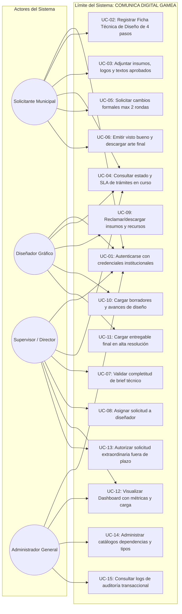
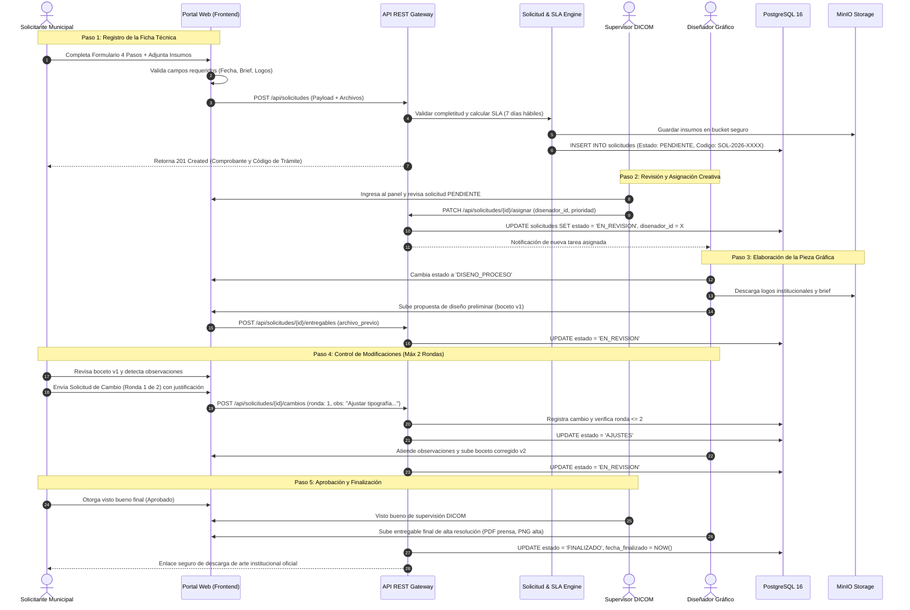
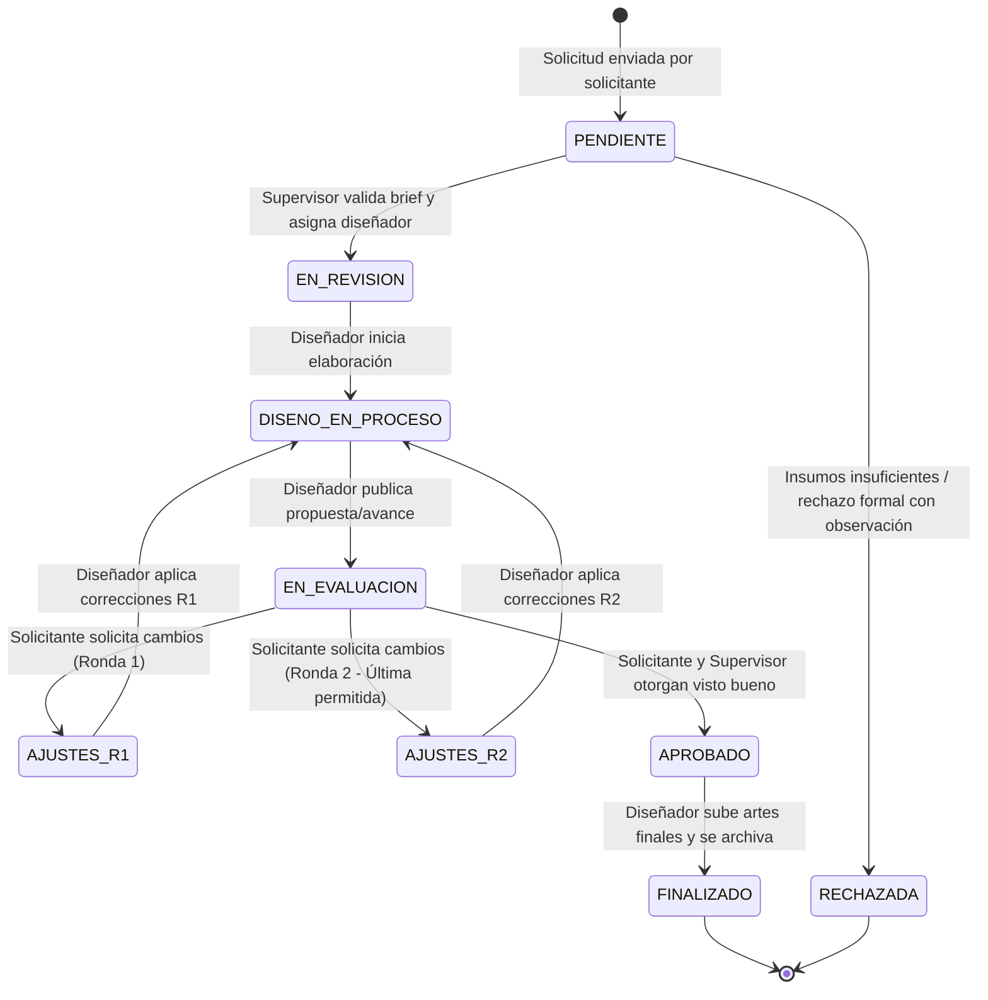
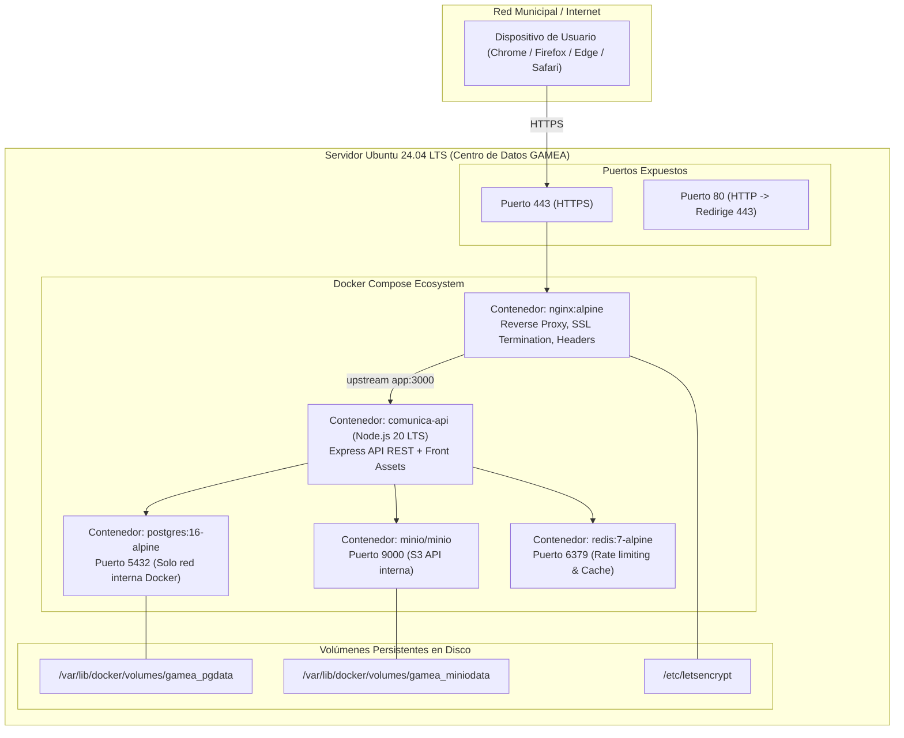

# Diagramas UML Oficiales
## COMUNICA DIGITAL GAM El Alto
### Plataforma Digital de Gestión Creativa Institucional

Este documento contiene la especificación formal de los diagramas UML que modelan el comportamiento, estructura y despliegue del sistema.

---

## 1. DIAGRAMA DE CASOS DE USO GENERAL

---

## 2. DIAGRAMA DE SECUENCIA: CICLO DE VIDA DE LA SOLICITUD Y CONTROL DE CAMBIOS

---

## 3. DIAGRAMA DE MÁQUINA DE ESTADOS (STATE MACHINE)

---

## 4. DIAGRAMA DE DESPLIEGUE EN SERVIDOR UBUNTU

