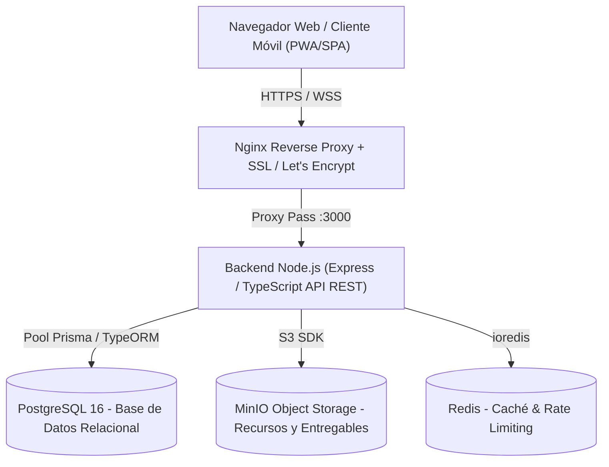

# Software Design Document (SDD)
## COMUNICA DIGITAL GAM El Alto
### Sistema Integral de Solicitudes, Gestión, Seguimiento y Producción de Servicios Comunicacionales Institucionales

**Entidad Patrocinante:** Gobierno Autónomo Municipal de El Alto (GAMEA)  
**Unidad Ejecutora:** Dirección de Comunicación (DICOM)  
**Versión:** 1.0.0 (Producción)  
**Metodología:** Spec-Driven Development (SDD) & Gobierno Digital  
**Estado:** Aprobado para Implementación  

---

## ÍNDICE GENERAL
1. [Fase 1: Análisis del Problema](#fase-1-análisis-del-problema)
2. [Fase 2: Definición de Requerimientos](#fase-2-definición-de-requerimientos)
3. [Fase 3: Arquitectura del Sistema](#fase-3-arquitectura-del-sistema)
4. [Fase 4: Diseño UX/UI y Experiencia Institucional](#fase-4-diseño-uxui-y-experiencia-institucional)
5. [Fase 5: Modelo de Datos y Persistencia](#fase-5-modelo-de-datos-y-persistencia)
6. [Fase 6: Desarrollo del Sistema y Modularidad](#fase-6-desarrollo-del-sistema-y-modularidad)
7. [Fase 7: Estrategia y Plan de Pruebas](#fase-7-estrategia-y-plan-de-pruebas)
8. [Fase 8: Implementación, Infraestructura y DevOps](#fase-8-implementación-infraestructura-y-devops)
9. [Fase 9: Capacitación Institucional y Gestión del Cambio](#fase-9-capacitación-institucional-y-gestión-del-cambio)

---

## FASE 1: ANÁLISIS DEL PROBLEMA

### 1.1 Contexto Institucional
El Gobierno Autónomo Municipal de El Alto (GAMEA), una de las urbes más dinámicas y pobladas del Estado Plurinacional de Bolivia, cuenta con más de una decena de Secretarías Municipales, múltiples Direcciones Generales, Unidades Operativas y Jefaturas. Todas estas dependencias generan continuamente actos protocolares, inauguraciones de obras públicas, campañas de salud, actividades culturales, festividades cívicas y normativas que requieren soporte de comunicación visual de alta calidad y pertinencia cultural.

### 1.2 Diagnóstico de la Situación Actual ("As-Is")
Hasta el presente ciclo, el flujo de requerimientos hacia la Dirección de Comunicación (DICOM) operaba de manera fragmentada:
- **Canales Informales:** Solicitudes enviadas por mensajería instantánea (WhatsApp), notas físicas en papel membretado sin formato homogéneo, o llamadas telefónicas directas.
- **Falta de Estandarización de Brief:** Las solicitudes carecen de textos definitivos revisados por asesoría jurídica o protocolo, adjuntos en baja resolución o sin especificación de público objetivo.
- **Opacidad en el Estado de Avance:** Las secretarías solicitantes desconocen si su solicitud fue recepcionada, si está asignada a un diseñador o cuándo estará lista.
- **Cuellos de Botella Creativos:** El equipo de diseño de la DICOM recibe pedidos de carácter "urgente" simultáneos sin una ponderación de impacto municipal.
- **Ciclos Infinitos de Modificación:** Se realizaban ajustes sobre ajustes (más de 5 a 8 rondas de cambios arbitrarios) alterando la fecha de entrega original.
- **Ausencia de Trazabilidad e Historial:** No existía un repositorio centralizado de piezas gráficas entregadas, provocando duplicidad de esfuerzos y pérdida de memoria gráfica institucional.

### 1.3 Objetivos de Transformación Digital ("To-Be")
- **Centralización Digital Unificada y Privada:** El formulario de solicitudes y el seguimiento de trámites se restringen exclusivamente a servidores públicos autenticados mediante cuentas institucionales asignadas a cada Secretaría y Dirección Municipal. No se permite el acceso público ni el envío indiscriminado de solicitudes.
- **Alineación con el Organigrama Oficial (D.M. N° 200 - Gestión 2026):** Estructuración de las 14 Secretarías/Entidades de Nivel Ejecutivo y sus 43 Direcciones y Hospitales Municipales, garantizando que cada solicitud se vincule de forma inmutable a la unidad solicitante acreditada.
- **Validación Sintáctica y Semántica Previa:** Impedir el ingreso de solicitudes incompletas o sin insumos aprobados.
- **Trazabilidad Integral y SLA:** Asignar automáticamente un número de trámite único (código correlativo `SOL-YYYY-XXXX`), fecha de recepción y fecha límite fijada normativamente (hasta 7 días hábiles de producción estándar).
- **Racionalización de Cambios:** Limitar formalmente las observaciones a un máximo de **2 rondas de cambios estructuradas**.
- **Panel de Inteligencia Institucional:** Dotar al Director de Comunicación y al Despacho de la Alcaldesa de métricas de carga operativa, dependencias con mayor demanda y rendimiento de producción.

### 1.4 Estructura Orgánica Oficial Homologada (D.M. N° 200)
El sistema modela fielmente la jerarquía municipal aprobada mediante Decreto Municipal N° 200 para la Gestión 2026:

1. **Despacho Alcaldesa:**
   - Dirección General de Asesoría Legal (DGAL)
   - Dirección de Relaciones Internacionales (DRI)
   - Unidad de Relaciones Públicas y Protocolo (URPP)
   - Unidades Asesoras: Auditoría Interna, Transparencia y Lucha Contra la Corrupción, Sumariante.
2. **Secretaría Municipal de Gestión Institucional (SMGI):**
   - **Dirección de Comunicación (DICOM)** *(Unidad Rectora del Sistema Creativo)*
   - Dirección de Atención Ciudadana (DAC)
3. **Secretaría Municipal de Administración y Finanzas (SMAF):**
   - Dirección Administrativa (DIR-ADM)
   - Dirección de Contrataciones (DIR-CONT)
   - Dirección del Tesoro Municipal (DIR-TES)
   - Dirección de Administración Tributaria Municipal (DATM)
   - Dirección de Talento Humano (DTH)
4. **Secretaría Municipal de Planificación (SMP):**
   - Dirección de Planificación (DIPLAN)
   - Dirección de Administración Territorial y Catastro (DATC)
5. **Secretaría Municipal de Movilidad Urbana (SMMU):**
   - Dirección de Regulación de la Movilidad Urbana (DRMU)
   - Dirección Municipal de Transporte Público – Bus Municipal (DMTP-BUS)
6. **Secretaría Municipal de Educación y Cultura (SMEC):**
   - Dirección de Cultura (DICCULT)
   - Dirección de Deportes (DIR-DEP)
   - Dirección de Atención y Servicios de Educación (DASE)
7. **Secretaría Municipal de Desarrollo Humano y Social Integral (SMDHSI):**
   - Dirección de Niñez, Género y Atención Social (DNGAS)
   - Dirección de Desarrollo Integral (DDI)
8. **Secretaría Municipal de Seguridad Ciudadana (SMSC):**
   - Dirección de Seguridad Pública, Programas y Soluciones Tecnológicas (DSPPST)
   - Intendencia, Guardia y Banda Municipal (IGBM)
   - Dirección de Ferias y Mercados (DFM)
9. **Secretaría Municipal de Salud (SMS):**
   - Dirección de Gestión en Salud (DGS)
   - Dirección de Gestión Servicios de Salud Nivel Desconcentrado (DGSSND)
   - Dirección de Establecimientos de Salud de Primer Nivel (DESPN)
   - Red de Hospitales Municipales (Boliviano Holandés, Los Andes, Modelo Corea, Qullañ Uta, Modelo Japonés)
10. **Secretaría Municipal de Infraestructura Pública (SMIP):**
    - Dirección de Proyectos Municipales (DPM)
    - Dirección de Supervisión de Obras (DSO)
    - Dirección de Fiscalización de Obras (DFO)
    - Dirección de Obras Municipales (DOM)
    - Dirección de Alumbrado Público (DAP)
11. **Secretaría Municipal de Agua, Saneamiento, Gestión Ambiental y Riesgos (SMASGAR):**
    - Dirección de Gestión Integral de Residuos (DGIR)
    - Dirección de Saneamiento Básico, Recursos Hídricos y Control Ambiental (DSBRHCA)
    - Dirección de Gestión de Riesgos (DGR)
    - Dirección de Forestación y Áreas Protegidas (DFAP)
12. **Secretaría Municipal de Desarrollo Económico (SMDE):**
    - Dirección de Desarrollo Productivo Artesanal (DDPA)
    - Dirección de Agropecuaria y Seguridad Alimentaria (DASA)
    - Dirección de Desarrollo Productivo de Pequeñas y Medianas Empresas (DDPPYME)
    - Dirección de Servicios Municipales e Iniciativas Económicas (DSMEI)
13. **Subalcaldías Municipales (Distritos 1 al 14):**
    - Distritos Urbanos (D-1 al D-7)
    - Distritos Urbanos y Rurales (D-8 al D-14)
14. **Nivel Descentralizado y Empresas:**
    - Terminal Metropolitana El Alto (TMEA)
    - Laboratorio Industrial de Oxígeno Medicinal – G.A.M.E.A. (LIOM)

## FASE 2: DEFINICIÓN DE REQUERIMIENTOS

### 2.1 Requerimientos Funcionales (RF)

| ID | Módulo | Descripción | Rol(es) |
|---|---|---|---|
| **RF-01** | Autenticación | Inicio de sesión seguro con credenciales institucionales, tokens JWT y soporte para recuperación de contraseña. | Todos |
| **RF-02** | Ficha Técnica Oficial (6 Secciones) | Formulario digital estandarizado idéntico al documento oficial del GAMEA: 1. Datos del Evento, 2. Características del Diseño, 3. Formato y Difusión, 4. Material a Entregar (Checklist), 5. Datos del Solicitante (Coordinación), 6. Consideraciones y V.º B.º. | Solicitante |
| **RF-03** | Motor de Validación | Validación estricta en frontend y backend: no permite envío sin fecha de evento, objetivo, texto aprobado, contacto responsable y logos/insumos mínimos. | Sistema / Solicitante |
| **RF-04** | Cálculo Automático de SLA | Generación de fecha de recepción y fecha límite de entrega respetando la regla institucional de 7 días hábiles. | Sistema |
| **RF-05** | Flujo de Estados | Gestión del ciclo de vida con 6 estados normados: `🟡 Pendiente`, `🔵 En revisión`, `🟣 Diseño en proceso`, `🟠 Ajustes`, `🟢 Aprobado`, `⚫ Finalizado`. | Diseñador, Supervisor |
| **RF-06** | Asignación Creativa | El Supervisor asigna la solicitud a un Diseñador Gráfico específico o reasigna por sobrecarga laboral. | Supervisor, Admin |
| **RF-07** | Carga de Entregables | El Diseñador carga avances (JPG, PNG, PDF para previsualización) y enlaces finales de alta resolución. | Diseñador |
| **RF-08** | Control de Modificaciones | Registro de observaciones de cambio: limita a máximo 2 rondas. Registra fecha, usuario, justificación y versión previa vs nueva. | Solicitante, Diseñador |
| **RF-09** | Aprobación Formal | El Solicitante o Supervisor otorga el visto bueno final formal registrando marca temporal y usuario firmante. | Solicitante, Supervisor |
| **RF-10** | Repositorio / Catálogo | Búsqueda por secretaría, fecha, tipo de pieza, palabras clave y descarga de piezas aprobadas. | Todos |
| **RF-11** | Tablero de Control / Dashboard | Visualización de KPIs: total solicitudes, finalizadas, pendientes, tiempos promedio, dependencias con más demanda y gráficos mensuales. | Supervisor, Admin |
| **RF-12** | Auditoría Completa | Registro inmutable de cada acción (quién, qué acción, IP, fecha, estado previo y posterior). | Admin, Auditoría |
| **RF-13** | Gestión de Catálogos | CRUD de Secretarías, Direcciones, Unidades y Tipos de Pieza gráfica. | Admin |

### 2.2 Especificación Detallada de la Ficha Técnica Oficial (6 Secciones)
El diseño del formulario implementa con 100% de fidelidad la *Ficha Técnica de Solicitud de Diseño Gráfico - GAM El Alto Jach'a Uta*:

1. **Sección 1: Datos del Evento o Actividad:**
   - *Objetivo Institucional:* Recopilar la información indispensable para orientar correctamente la elaboración de piezas gráficas institucionales y optimizar los tiempos de atención a las diferentes dependencias municipales.
   - *Organizadores / Logos:* Secretaría y Dirección solicitante seleccionadas y bloqueadas por la sesión autenticada (Organigrama D.M. N° 200).
   - *Título del evento:* Denominación oficial de la actividad.
   - *Fecha y hora:* Cronograma exacto del evento.
   - *Lugar:* Ubicación, plaza, distrito o predio municipal.
   - *Dirigido a:* Público objetivo (jóvenes, estudiantes, población en general, funcionarios, etc.).
   - *Objetivo / mensaje principal:* Qué se quiere comunicar o lograr con la pieza.
   - *Datos adicionales:* Teléfono, redes, página web, QR, requisitos, inscripción, etc.

2. **Sección 2: Características del Diseño:**
   - *Tipo de diseño:* Afiche informativo, Póster, Volante / Flyer, Tríptico / Díptico, Invitación, Banner, Infografía, Redes sociales, Otro (con campo libre de especificación).
   - *Estilo visual:* Institucional / formal, Moderno, Juvenil, Colorido / dinámico, Minimalista / limpio, Educativo, Cultural, Otro (con campo libre de especificación).

3. **Sección 3: Formato y Medio de Difusión:**
   - *Material:* Impreso, Digital, Ambos.
   - *Si es impreso, tamaño:* Campo específico (ej: Carta, Oficio, A3, 2x1 m).
   - *Orientación:* Vertical, Horizontal.
   - *Si es digital, indicar plataforma:* Facebook, Instagram, TikTok, WhatsApp, Web, Pantallas, Otro (con campo libre de especificación).
   - *Formato requerido:* Campo específico (ej: PDF imprenta, JPG, PNG transparente, MP4).

4. **Sección 4: Material que debe entregar la Unidad Solicitante:**
   - *Checklist de Compromiso:*
     - ☐ Texto revisado y aprobado
     - ☐ Logotipos en buena calidad
     - ☐ Fotografías / imágenes
     - ☐ Códigos QR / enlaces
     - ☐ Otros elementos necesarios
   - *Caja de texto:* Brief oficial redactado.
   - *Cargador de archivos:* Zona drag & drop para adjuntos.
   - *Nota Institucional:* "Los textos, nombres, fechas, horarios, cargos, teléfonos y demás información proporcionada deberán ser revisados y aprobados previamente por la unidad solicitante. El área de diseño realizará la composición y tratamiento gráfico de la información recibida."

5. **Sección 5: Datos del Solicitante (para coordinar):**
   - *Nombre y cargo del solicitante:* Autocompletado desde la sesión institucional.
   - *Teléfono / WhatsApp:* Número directo de contacto para consultas técnicas con el diseñador de DICOM.

6. **Sección 6: Consideraciones para la Atención de Solicitudes y V.º B.º:**
   - Despliegue explícito de los 6 puntos normativos (plazo de 7 días, límite de 3 piezas, 2 rondas de cambios consolidadas, etc.).
   - Checkbox obligatorio: *Firma / V.º B.º del responsable solicitante* asumiendo conformidad con las disposiciones vigentes.

### 2.2 Requerimientos No Funcionales (RNF)
- **RNF-01 Seguridad y Confidencialidad:** Cifrado TLS 1.3 en tránsito, hash de contraseñas con Argon2id/Bcrypt (factor 12), protección CORS, Helmet y Rate Limiting contra DoS.
- **RNF-02 Rendimiento y Concurrencia:** Tiempo de respuesta de endpoints API < 300 ms en el percentil 95. Soporte para 200 usuarios concurrentes simultáneos.
- **RNF-03 Disponibilidad:** Disponibilidad del servicio del 99.8% (SLA municipal).
- **RNF-04 Accesibilidad y Usabilidad:** Cumplimiento con las directrices de accesibilidad web **WCAG 2.1 nivel AA**. Diseño plenamente responsivo (Mobile-first, Tablet, Desktop).
- **RNF-05 Almacenamiento Seguro de Objetos:** Subida de recursos gráficos y logos a MinIO (S3-compatible) con políticas de tamaño máximo (50 MB por archivo de insumo, previsualizaciones optimizadas WebP/PDF).

### 2.3 Reglas de Negocio Institucionales (RN)
- **RN-01 (Antelación Mínima):** Las solicitudes deben enviarse con al menos 7 días hábiles de anticipación a la fecha de realización del evento. Si la fecha es menor, el sistema emite una alerta de solicitud extraordinaria que requiere autorización explícita de DICOM.
- **RN-02 (Brief Obligatorio):** Ninguna solicitud entra a la cola de producción creativa sin texto definitivo aprobado por la unidad solicitante. Se prohíbe el uso de textos simulados (*Lorem Ipsum*) por parte de las dependencias.
- **RN-03 (Límite de Rondas de Cambio):** Solo se admiten **2 rondas de observaciones**. Superada la segunda ronda, cualquier cambio adicional requiere emisión de un justificativo técnico aprobado por el Director de Comunicación.
- **RN-04 (Inmutabilidad de Auditoría):** Ningún registro de auditoría puede ser eliminado o actualizado (`APPEND-ONLY`).

---

## FASE 3: ARQUITECTURA DEL SISTEMA

### 3.1 Estilo Arquitectónico
Se adopta una **Arquitectura en Capas Limpia (Clean Architecture) con enfoque Modular Monolith / Microservicios Preparados**, garantizando bajo acoplamiento y alta cohesión.



### 3.2 Capas del Sistema
1. **Capa de Presentación:** Desarrollada con React / Next.js, componentes accesibles con tokens de diseño del GAMEA, validación con React Hook Form + Zod.
2. **Capa de Puerta de Enlace (API Gateway / Reverse Proxy):** Servidor Nginx configurado para compresión Gzip/Brotli, terminación SSL/TLS, buffers de carga de archivos hasta 100 MB y filtrado de cabeceras de seguridad (HSTS, CSP, X-Frame-Options).
3. **Capa de Aplicación y Dominio (Backend):** Node.js con TypeScript estructurado por módulos de dominio:
   - `auth/`: Autenticación, JWT, roles RBAC.
   - `solicitudes/`: Gestión de requerimientos y motor de validación.
   - `asignaciones/`: Despacho y asignación a diseñadores.
   - `cambios/`: Motor de control de modificaciones (máx. 2 rondas).
   - `entregables/`: Carga de piezas finales y previsualizaciones.
   - `dashboard/`: Consultas analíticas y reportes agregados.
   - `auditoria/`: Logging transaccional inmutable.
4. **Capa de Persistencia:** PostgreSQL 16 con constraints de integridad referencial, índices optimizados B-Tree y GiST, particionamiento lógico para auditoría.

---

## FASE 4: DISEÑO UX/UI Y EXPERIENCIA INSTITUCIONAL

### 4.1 Identidad Visual y Paleta Institucional (GAM El Alto)
- **Rojo / Guindo Municipal:** `#7A1315` (Símbolo de fuerza, coraje y dignidad alteña).
- **Dorado Cívico:** `#D4AF37` / `#B8860B` (Calidad institucional y excelencia).
- **Azul Corporativo Profundo:** `#0D2E5C` (Solidez administrativa y transparencia).
- **Gris Pizarra / Neutros:** `#1E293B`, `#64748B`, `#F8FAFC` (Legibilidad y descanso visual).
- **Colores Semánticos de Estado:**
  - 🟡 `Pendiente`: `#EAB308` (Ámbar)
  - 🔵 `En revisión`: `#3B82F6` (Azul zafiro)
  - 🟣 `Diseño en proceso`: `#8B5CF6` (Púrpura creativo)
  - 🟠 `Ajustes`: `#F97316` (Naranja alerta)
  - 🟢 `Aprobado`: `#10B981` (Verde esmeralda)
  - ⚫ `Finalizado`: `#475569` (Gris institucional completado)

### 4.2 Principios de Usabilidad y Estándares de Diseño Visual
- **Stepper Ejecutivo de 5 Pasos:** Implementación secuencial de alta legibilidad que cubre con 100% de paridad las 6 secciones de la Ficha Técnica del GAMEA:
  - *Paso 01:* Datos del Evento o Actividad (Secretaría/Dirección según D.M. 200, título, fecha, lugar, público, objetivo y datos adicionales).
  - *Paso 02:* Características del Diseño (tipo de pieza y estilo visual con opción libre reactiva).
  - *Paso 03:* Formato y Medio de Difusión (impreso con dimensiones, digital con plataformas y formato requerido).
  - *Paso 04:* Material e Insumos (checklist obligatorio de 5 insumos, brief textual y zona drag & drop).
  - *Paso 05:* Solicitante y V.º B.º (datos de coordinación, consideraciones normativas y firma de visto bueno).
- **Tipografía y Jerarquía Visual:** Tipografías combinadas de alta definición: *Outfit* para títulos principales y números de paso; *Inter* para el cuerpo y controles de formulario.
- **Accesibilidad y Alto Contraste (WCAG 2.1 AA):** Cabeceras institucionales con fondos guindo oscuro `#4A0709` / `#7A1315` combinadas con textos blanco puro `#FFFFFF`, pill de objetivo en dorado luminoso `#FEE685` y botones con micro-interacciones sutiles de elevación.
- **Stepper Interactivo Reactivo:** Indicadores de estado circular con micro-animaciones (activo en guindo `#7A1315` con halo de foco, completado en verde azulado `#0D9488` con glifo de verificación `✓` y conector progresivo iluminado).

---

## FASE 5: MODELO DE DATOS Y PERSISTENCIA

El modelo relacional fue diseñado para garantizar tercera forma normal (3NF), soporte para auditoría completa y escalabilidad para las futuras fases (logos, revistas, audiovisual, IA).

### Entidades Principales
1. `roles`: Roles del sistema (`ADMIN`, `SOLICITANTE`, `DISENADOR`, `SUPERVISOR`).
2. `secretarias`: Dependencias de primer nivel del GAMEA.
3. `direcciones`: Direcciones dependientes de las secretarías.
4. `unidades`: Unidades o jefaturas ejecutoras.
5. `usuarios`: Servidores públicos registrados con pertenencia orgánica y credenciales cifradas.
6. `tipos_diseno`: Catálogo de piezas (`Afiche`, `Flyer`, `Gigantografía`, `Redes Sociales`, `Tríptico`, etc.).
7. `solicitudes`: Tabla central de trámites con fechas, objetivo, público, SLA, estado actual y correlativo.
8. `solicitud_archivos`: Archivos adjuntos originales (logos, insumos, fotos, textos de brief).
9. `solicitud_cambios`: Registro de rondas de modificación (1 y 2), motivos, observador y archivos de contraste.
10. `entregables`: Versiones producidas por el diseñador (bocetos y artes finales).
11. `auditoria_eventos`: Trazabilidad forense de cada operación.

---

## FASE 6: DESARROLLO DEL SISTEMA Y MODULARIDAD

### 6.1 Estructura del Proyecto
```
comunica-digital-gamea/
├── docker-compose.yml
├── Dockerfile
├── nginx/
│   └── default.conf
├── src/
│   ├── backend/
│   │   ├── config/             # Variables de entorno y DB pool
│   │   ├── modules/
│   │   │   ├── auth/           # Login, JWT, middleware RBAC
│   │   │   ├── solicitudes/    # CRUD, validación Zod, SLA calc
│   │   │   ├── cambios/        # Validación máx 2 rondas
│   │   │   ├── entregables/    # Subida MinIO, control versiones
│   │   │   └── dashboard/      # Consultas SQL analíticas
│   │   ├── middlewares/        # Error handler, rate limit, audit
│   │   └── server.ts           # Entrada Express
│   └── shared/                 # Tipos TypeScript compartidos
├── web/                        # Aplicación Web Frontend
│   ├── index.html
│   ├── css/
│   │   └── styles.css          # Estilos institucionales pulidos
│   └── js/
│       ├── app.js              # Controlador principal SPA
│       ├── components/         # Formularios, modals, charts
│       └── mockData.js         # Datos iniciales para demostración
└── docs/                       # Documentación formal y manuales
```

---

## FASE 7: ESTRATEGIA Y PLAN DE PRUEBAS

1. **Pruebas Unitarias:** Validación de reglas de negocio con Jest/Vitest (cálculo de 7 días hábiles excluyendo fines de semana, regla de máximo 2 cambios).
2. **Pruebas de Integración:** Validación de endpoints REST con Supertest y base de datos de prueba en Docker.
3. **Pruebas de Carga (Stress Testing):** Simulación con k6 de 200 usuarios concurrentes enviando solicitudes y descargando entregables.
4. **Pruebas de Seguridad:** Análisis estático SAST, prevención de inyecciones SQL (uso estricto de consultas parametrizadas), prevención de XSS y protección CSRF.

---

## FASE 8: IMPLEMENTACIÓN, INFRAESTRUCTURA Y DEVOPS

- **Sistema Operativo y Servidor:** Ubuntu Server 24.04 LTS (Host: `localhost` / `host.docker.internal` en Coolify).
- **Plataforma de Despliegue (PaaS Institucional):** Coolify v4.x con proxy Traefik v3.6, SSL automático Let's Encrypt y red interna Docker `coolify`.
- **Servicios Desplegados en Producción (Proyecto: `Creativos GAMEA`):**
  1. `creativos-app` (`qa1udxjicxskny3hkask9yat`): Aplicación Web en Nginx Alpine, accesible en `https://creativos.elalto.gob.bo`.
  2. `creativos-postgres` (`0gmfrh8ddb9co6u0nvmbx4ci`): Base de datos PostgreSQL 16 Alpine standalone con healthcheck activo (`running:healthy`), red aislada `coolify`, base de datos `creativos_db` y usuario `creativos_user`.
- **Variables de Entorno Inyectadas:** `DATABASE_URL`, `PGHOST`, `PGPORT`, `PGDATABASE`, `PGUSER`, `PGPASSWORD`.
- **Plan de Respaldo (Backup):** Respaldo automatizado de base de datos mediante tareas programadas de Coolify y retención de snapshots de volumen.

---

## FASE 9: CAPACITACIÓN INSTITUCIONAL Y GESTIÓN DEL CAMBIO

- **Talleres de Inducción por Rol:** Jornadas prácticas para Secretarías Municipales sobre cómo elaborar un brief eficiente y cómo revisar piezas gráficas.
- **Canal de Soporte Interno:** Mesa de ayuda digital y manuales interactivos en línea accesibles permanentemente desde el encabezado de la plataforma.
- **Monitoreo de Adopción:** Evaluación quincenal del tiempo promedio de producción y tasa de aprobación en primera ronda.
