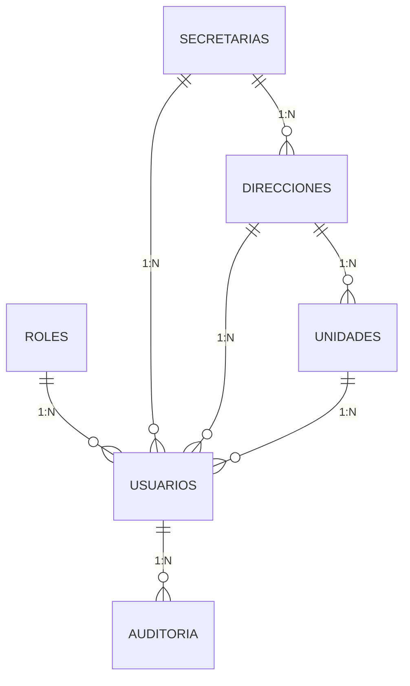

# Data Model: Módulo de Gestión de Usuarios y Roles

## Entidades Involucradas

### `usuarios` (tabla principal del módulo)

| Columna | Tipo | Constraints | Descripción |
|---------|------|-------------|-------------|
| `id` | UUID | PK, DEFAULT uuid_generate_v4() | Identificador único |
| `rol_id` | INT | FK → roles(id), NOT NULL | Rol asignado |
| `secretaria_id` | INT | FK → secretarias(id), NULLABLE | Secretaría de pertenencia |
| `direccion_id` | INT | FK → direcciones(id), NULLABLE | Dirección de pertenencia |
| `unidad_id` | INT | FK → unidades(id), NULLABLE | Unidad/jefatura (nivel 3) |
| `nombres` | VARCHAR(100) | NOT NULL | Nombres del servidor público |
| `apellidos` | VARCHAR(100) | NOT NULL | Apellidos |
| `cargo` | VARCHAR(150) | NULLABLE | Cargo institucional |
| `email` | VARCHAR(150) | UNIQUE, NOT NULL | Email institucional (login) |
| `telefono_contacto` | VARCHAR(30) | NULLABLE | Teléfono/WhatsApp |
| `password_hash` | VARCHAR(255) | NOT NULL | Hash bcrypt (factor 12) |
| `activo` | BOOLEAN | DEFAULT TRUE | Soft-delete flag |
| `ultimo_acceso` | TIMESTAMPTZ | NULLABLE | Último inicio de sesión |
| `created_at` | TIMESTAMPTZ | DEFAULT NOW() | Fecha de creación |
| `updated_at` | TIMESTAMPTZ | DEFAULT NOW() | Última actualización |

### `roles` (catálogo estático)

| Columna | Tipo | Constraints | Descripción |
|---------|------|-------------|-------------|
| `id` | SERIAL | PK | ID secuencial |
| `codigo` | VARCHAR(30) | UNIQUE, NOT NULL | Código: ADMIN, SUPERVISOR, DISENADOR, SOLICITANTE |
| `nombre` | VARCHAR(80) | NOT NULL | Nombre descriptivo |
| `descripcion` | TEXT | NULLABLE | Descripción editable |
| `activo` | BOOLEAN | DEFAULT TRUE | Siempre TRUE para roles base |

### Relaciones

### No se modifica el esquema DDL

Las tablas ya existen en `docs/database/database-schema.sql`. No se requiere ninguna migración adicional.

## Validaciones Server-Side

### Creación de Usuario

| Campo | Regla | Error |
|-------|-------|-------|
| `nombres` | Obligatorio, 2-100 chars | "Los nombres son obligatorios" |
| `apellidos` | Obligatorio, 2-100 chars | "Los apellidos son obligatorios" |
| `email` | Obligatorio, formato email, UNIQUE | "Email inválido" / "Este email ya está registrado" |
| `password` | Obligatorio, min 8 chars, al menos 1 mayúscula + 1 número | "La contraseña debe tener al menos 8 caracteres, una mayúscula y un número" |
| `rol_id` | Obligatorio, debe existir en `roles` | "Rol no válido" |
| `secretaria_id` | Si `rol_id` = SOLICITANTE, obligatorio | "Debe seleccionar una secretaría para el solicitante" |
| `direccion_id` | Si se provee, debe pertenecer a `secretaria_id` | "La dirección no pertenece a la secretaría seleccionada" |

### Edición de Usuario

- `email` NO se puede modificar
- `password_hash` NO se puede modificar (usar endpoint de reset)
- Si se cambia `rol_id`: verificar que no sea el último ADMIN degradándose

### Desactivación

- No se puede auto-desactivar
- Si es el último ADMIN activo, rechazar
- Si tiene solicitudes activas asignadas, advertir (no bloquear)
